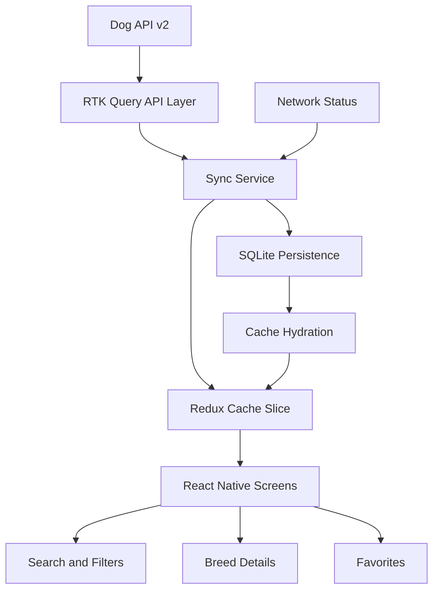

# PawBuddy 🐾

PawBuddy is a React Native + TypeScript dog breed explorer app built for the Tripare AI React Native assessment.

The app focuses on breed discovery, filtering, breed details, favorites, image galleries, offline-first caching, and network-aware synchronization.

## Features

- Dog breed listing with grouped breed sections
- Debounced search by breed name and alternative names
- Multi-select filters:
  - Breed group
  - Size band
  - Coat length
  - Hypoallergenic status
  - Trait score threshold
- Breed details with:
  - Overview
  - Traits
  - Gallery
  - Breed information such as origin, life span, weight, and height
- Favorites support
- Offline cache using SQLite
- Network status handling
- Background/manual synchronization when the network is available
- Partial sync failure handling while keeping cached data available
- Retry support for API requests
- Cached images
- Pull-to-refresh
- Onboarding and splash screens
- Settings screen
- Type-safe React Navigation
- Light, premium PawBuddy user interface

## Tech Stack

- React Native `0.87.1`
- TypeScript
- Redux Toolkit
- RTK Query
- React Navigation
- SQLite
- AsyncStorage
- React Native FS
- React Native NetInfo
- React Native SVG
- Lucide React Native
- Jest
- Patch Package

## API

This project uses the Dog API v2:

https://dogapi.dog/docs/api-v2

Base URL:

```text
https://dogapi.dog/api/v2
```

Used endpoints:

```text
GET /breeds
GET /breeds/:id
GET /groups
```

Breed pages are requested with a default page size of 48 records.

## Architecture Overview

The application follows an API → Cache → Redux Store → UI flow.



### Data Flow

1. The app initializes the local SQLite database.
2. Previously cached breeds, groups, and sync metadata are loaded.
3. Cached data is placed into the Redux store.
4. When an internet connection is available, the sync service requests breed pages and groups.
5. Successful results are stored in SQLite and Redux.
6. If a page fails, available cached data remains visible and the UI reports the sync issue.
7. Breed details can be refreshed individually when network access is available.

## Project Structure

```text
src/
├── api/
│   └── dogApi.ts
├── components/
│   ├── BreedCard.tsx
│   ├── CachedImage.tsx
│   ├── FilterBottomSheet.tsx
│   ├── Icon.tsx
│   ├── ShimmerPlaceholder.tsx
│   └── UI.tsx
├── database/
│   ├── index.ts
│   └── sqlite.ts
├── navigation/
│   ├── AppNavigator.tsx
│   └── types.ts
├── screens/
│   ├── BreedDetailScreen.tsx
│   ├── FavoritesScreen.tsx
│   ├── FilterScreen.tsx
│   ├── GalleryScreen.tsx
│   ├── HomeScreen.tsx
│   ├── OnboardingScreen.tsx
│   ├── SettingsScreen.tsx
│   ├── SplashScreen.tsx
│   └── SyncScreen.tsx
├── store/
│   ├── appSlice.ts
│   ├── Bootstrap.tsx
│   ├── cacheSlice.ts
│   ├── hooks.ts
│   ├── store.ts
│   ├── syncService.ts
│   └── syncSlice.ts
├── theme/
├── types/
├── utils/
└── __tests__/
```

## Quick Start

### Requirements

- Node.js `>= 22.11.0`
- Android Studio and Android SDK for Android development
- A configured Android emulator or physical Android device
- React Native development environment configured

### Install dependencies

From the project root:

```bash
npm install
```

### Start Metro

```bash
npm start
```

### Run Android

Open another terminal in the project root:

```bash
npm run android
```

### Run iOS

On macOS, install iOS dependencies first:

```bash
bundle install
bundle exec pod install
```

Then run:

```bash
npm run ios
```

## Available Scripts

```bash
npm start
npm run android
npm run ios
npm run lint
npm test
```

## Testing

The project includes Jest tests for utility functions such as:

- Size band calculation
- Range formatting
- Partial range handling

Run tests with:

```bash
npm test
```

For a single test run without watch mode:

```bash
npm test -- --watchAll=false
```

## Offline-First Approach

The app uses SQLite to persist breed data, groups, and synchronization metadata.

When the device is offline:

- Cached breeds remain available.
- The app displays an offline status message.
- Synchronization is skipped until connectivity is available.
- Previously cached data is used instead of requiring a live API response.

When the network returns:

- The app can refresh the API data.
- Breed and group data are updated in the local database.
- The Redux cache is updated.
- The last synchronization time is stored.

## Error Handling

The application handles:

- Network unavailability
- API request failures
- Partial page synchronization failures
- Missing breeds in the offline cache
- Retry attempts for API requests

When synchronization is incomplete, the app keeps available cached data and displays a relevant error message.

## Performance Notes

The app uses:

- `FlatList` for rendering breed records
- Debounced search
- Memoized filtering and grouping
- Cached data for faster subsequent launches
- Image caching utilities
- Shimmer placeholders during loading
- Paginated API requests

Performance measurements such as bundle size, memory usage, and FPS should be recorded on the target test device before final submission if required by the assessment.

## Screenshots

Add screenshots here before submission, for example:

1. Breed list in light mode
2. Search and filters
3. Breed details overview
4. Traits tab
5. Gallery screen
6. Offline/synchronization state

Example:

```text
docs/screenshots/
├── breed-list.png
├── filters.png
├── breed-details.png
├── traits.png
├── gallery.png
└── offline-state.png
```

## Troubleshooting

### Android build

Make sure the Android emulator or device is running and that the React Native environment is configured correctly.

```bash
npx react-native doctor
```

### Metro port already in use

If port `8081` is already occupied, stop the existing Metro process or allow React Native CLI to use another available port.

### Clean Android build

From the project root:

```bash
cd android
./gradlew clean
cd ..
npm run android
```

On Windows PowerShell:

```powershell
cd android
.\gradlew.bat clean
cd ..
npm run android
```

## Assignment Submission

- GitHub repository containing the complete source code
- README with setup and architecture information
- Required documentation and screenshots
- Working Android/iOS build where applicable
- Test results using `npm test`

## Application

**App Name:** PawBuddy

**Project:** Tripare AI React Native Assignment
