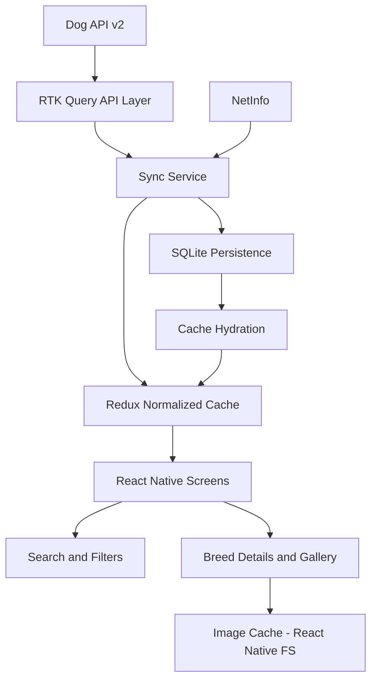

# Architecture

## Overview

Tripare Dog Breeds is a React Native + TypeScript application that follows an offline-first architecture. The Dog API v2 is used as the remote source of truth, while SQLite stores breeds, groups, and synchronization metadata locally. Redux Toolkit manages application state and the normalized in-memory cache.

The application loads local data first so that previously synchronized breeds remain available without a network connection. When connectivity is available, the app synchronizes breed pages and groups in the background. Partial page failures do not remove the existing cached data; the application reports the issue through the sync state and continues using the available records.

## Main Layers

- **Presentation:** React Native screens and reusable components.
- **Navigation:** React Navigation with typed route definitions.
- **State management:** Redux Toolkit, including RTK Query and normalized entity adapters.
- **API layer:** RTK Query with a retry wrapper and a 10-second request timeout.
- **Persistence:** SQLite tables for breeds, groups, and metadata.
- **Connectivity:** NetInfo for online/offline state and reconnect-triggered synchronization.
- **Image cache:** React Native FS cache directory with a 50 MB size limit.

## Data Flow

## Synchronization Flow

1. The bootstrap component hydrates app settings and the SQLite cache.
2. The cached breeds and groups are dispatched to Redux.
3. The application marks bootstrap as ready without waiting for remote synchronization.
4. NetInfo checks connectivity.
5. If online, the sync service fetches the first breed page and reads the API pagination metadata.
6. Remaining pages are requested concurrently using `Promise.allSettled`.
7. Successful pages are merged, persisted in SQLite, and written to the Redux cache.
8. Groups and the `last_sync` metadata value are persisted.
9. If one or more pages fail, cached/successfully fetched records remain available and a sync error is shown.
10. When the device transitions from offline to online, synchronization is triggered again.

## Persistence Schema

| Table | Purpose |
|---|---|
| `breeds` | Stores breed ID, name, group ID, and the serialized breed payload. |
| `groups_table` | Stores group ID, name, and the serialized group payload. |
| `meta` | Stores key/value metadata such as `last_sync`. |

The full API object is stored as JSON in the `payload` column. This keeps the local schema small while preserving nested attributes, relationships, traits, and image metadata.

## Filtering and Rendering

The home screen reads normalized breeds and groups from Redux. Search is debounced by 300 ms and checks the breed name and `other_names`. Filters are applied for group, size band, coat, hypoallergenic status, and a selected trait threshold. The resulting records are grouped by breed group and rendered through a list-based UI.
